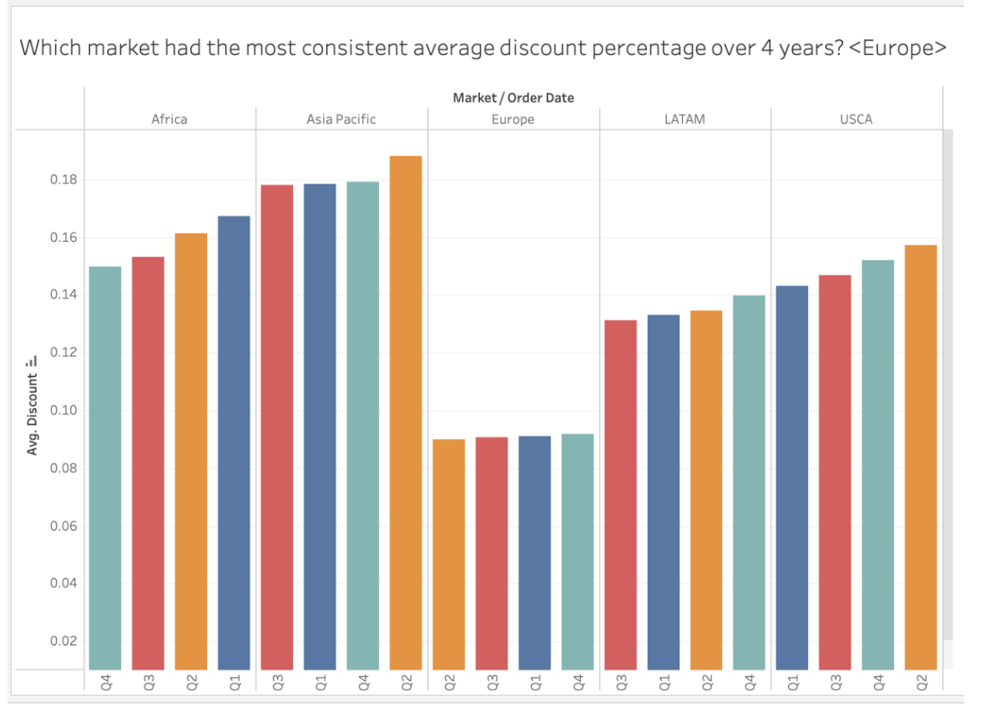

# 📊 Data Visualization using Tableau

## 🔍 Overview
This project analyzes **global sales trends, discounts, and profits** across multiple regions using **Tableau**.  
The analysis helps identify key business insights, such as:
- Which markets had the most consistent discount rates?
- Which region had the highest sales every year?
- Which country in Western Europe had the biggest order count?
- Which country experienced losses every year?

🔗 **Tableau Dashboard:**  
[View Interactive Dashboard](https://prod-uk-a.online.tableau.com/#/site/ilnazasaifutdinova96b55ad75d/workbooks/1107978?:origin=card_share_link)  

## 🛠️ Tools Used
- **Tableau** - Data visualization & dashboards  
- **SQL (if applicable)** - Data preprocessing  
- **Excel / CSV** - Dataset format  

## 📊 Key Insights
1️⃣ **Most Stable Discounts:**  
   - Europe had the most consistent discount percentage over 4 years.

2️⃣ **Highest Sales Region:**  
   - Western Europe had the highest sales in all analyzed years.

3️⃣ **Biggest Profit Loss:**  
   - The Netherlands showed **negative profits every year** in Western Europe.

4️⃣ **Most Orders Placed:**  
   - **France** had the highest number of orders across all years.

## 📂 Repository Structure

data-visualization-using-tableau
- README.md
- Ilnaza_Saifutdinova_Data_Visualisation.pdf
- dashboard_link.txt
- Screenshots/
  - discount_trends.png
  - top_sales_regions.png
  - profit_loss_by_country.png
  - most_orders.png
- dataset/
  - Global_Superstore_Returns_2016.csv
- .gitignore
